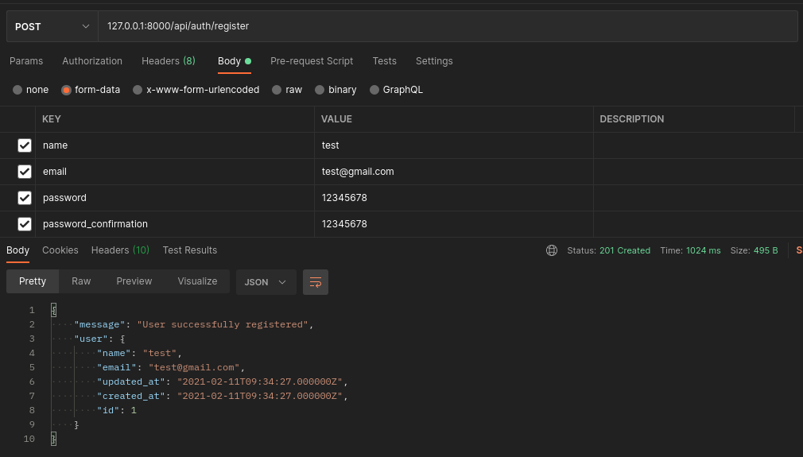
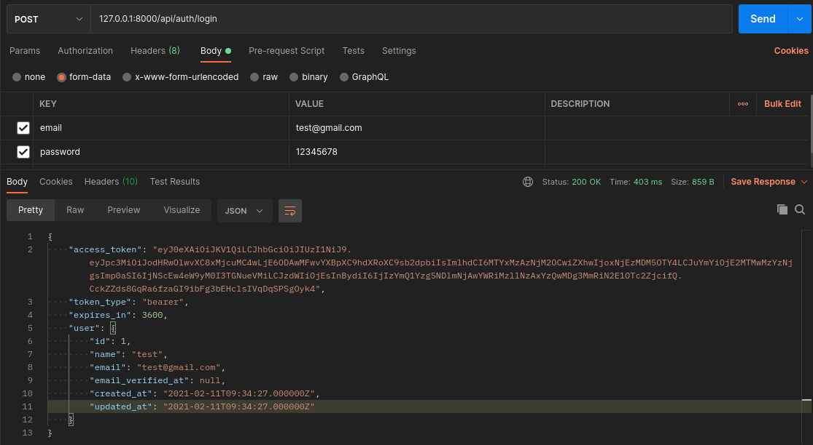
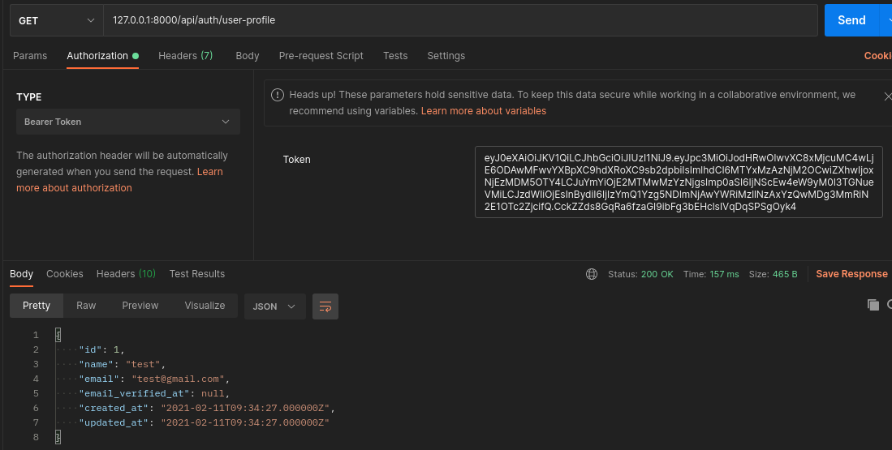
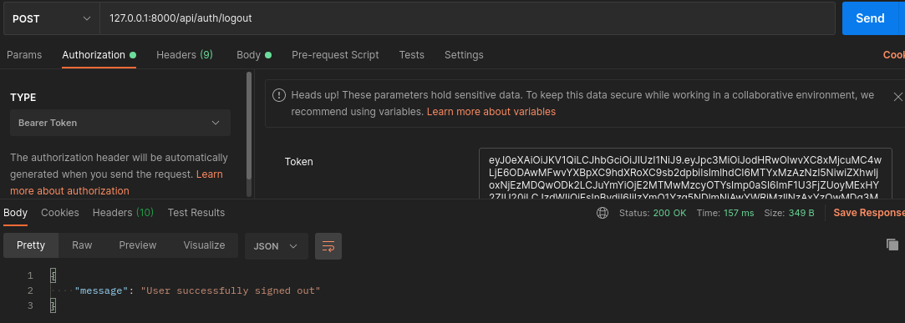

# Laravel_JWT_AUTH

## Table of Contents
- [Laravel_JWT_AUTH](#laravel_jwt_auth)
  - [Table of Contents](#table-of-contents)
  - [About](#about)
  - [Routes API](#routes-api)
  - [Screenshoot](#screenshoot)
  - [License](#license)

## About
Simple Laravel JWT AUTH. build with Laravel 8, PHP 8, and MariaDB.

## Routes API

Route prefix is `auth`, for detail check at `routes/api.php`

| Method  | Endpoint               |
|---------|------------------------|
| POST    | /api/auth/register     |
| POST    | /api/auth/login        |
| GET     | /api/auth/user-profile |
| POST    | /api/auth/refresh      |
| POST    | /api/auth/logout       |

## Screenshoot

1. User Registration

2. Login

3. User Profile

    Make sure `fill token` the header field `Authorization: Bearer Token`

4. JWT Token Refresh

    Make sure `fill token` the header field `Authorization: Bearer Token`

5. Logout

    Make sure `fill token` the header field `Authorization: Bearer Token`

## License

MIT License &copy; 2021
